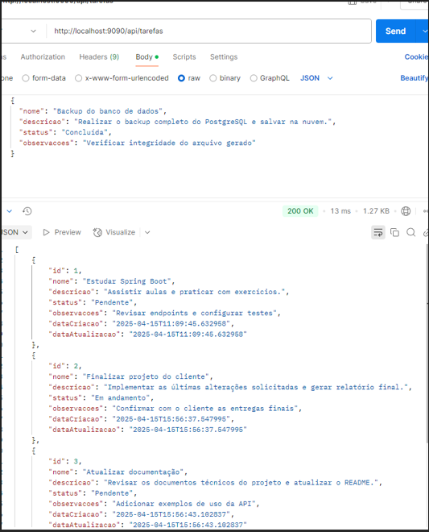
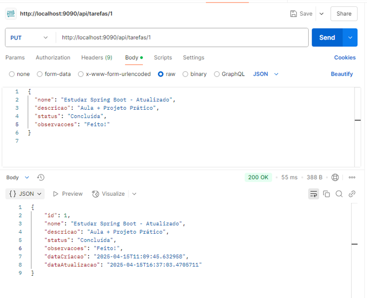
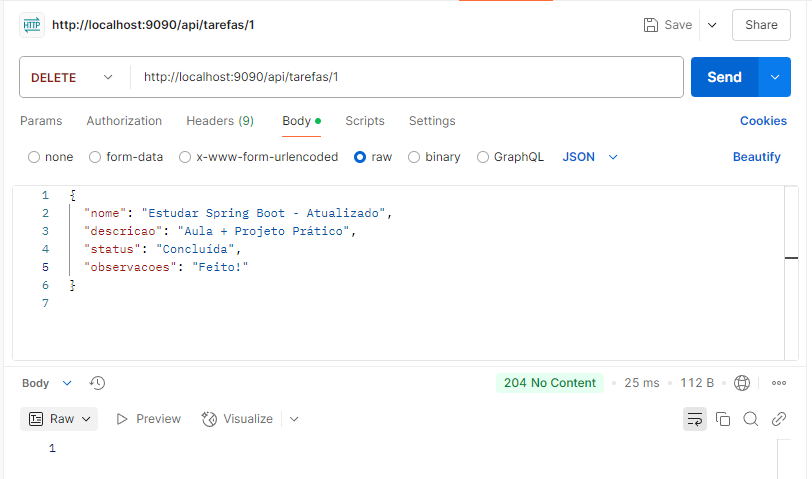
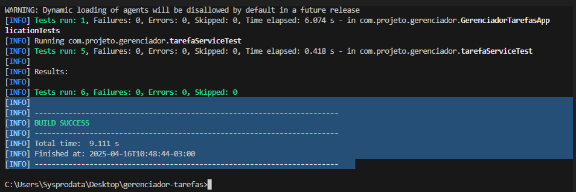

# 📌 Gerenciador de Tarefas - Spring Boot + PostgreSQL

Este projeto é uma API RESTful desenvolvida com **Java Spring Boot** e banco de dados **PostgreSQL**, com funcionalidades completas para **criação, leitura, atualização e exclusão (CRUD)** de tarefas.

---

## 🚀 Tecnologias Utilizadas

- Java 17+
- Spring Boot
- Spring Data JPA
- PostgreSQL
- Maven
- Postman (para testes de requisições)
- JUnit (para testes automatizados)

---

## 🔧 Funcionalidades da API

A aplicação permite:

- ✅ Criar uma nova tarefa (`POST`)
- 📋 Listar todas as tarefas (`GET`)
- ✏️ Atualizar uma tarefa existente (`PUT`)
- 🗑️ Deletar uma tarefa (`DELETE`)

---

## 📷 Exemplos de Requisições

### ✅ POST - Criar uma Tarefa

```http
POST http://localhost:9090/api/tarefas
```

```json
{
  "nome": "Backup do banco de dados",
  "descricao": "Realizar o backup completo do PostgreSQL e salvar na nuvem.",
  "status": "Concluída",
  "observacoes": "Verificar integridade do arquivo gerado"
}
```


---

### ✏️ PUT - Atualizar uma Tarefa

```http
PUT http://localhost:9090/api/tarefas/1
```

```json
{
  "nome": "Estudar Spring Boot - Atualizado",
  "descricao": "Aula + Projeto Prático",
  "status": "Concluída",
  "observacoes": "Feito!"
}
```


---

### 🗑️ DELETE - Deletar uma Tarefa

```http
DELETE http://localhost:9090/api/tarefas/1
```



---

## ✅ Testes Automatizados

Todos os testes foram executados com sucesso utilizando **JUnit**.



---

## 📁 Como Rodar o Projeto

1. Clone o repositório:
   ```bash
   git clone https://github.com/seu-usuario/gerenciador-tarefas.git
   ```
2. Abra com sua IDE (IntelliJ, Eclipse, etc.)
3. Configure o `application.properties` com seu banco de dados PostgreSQL.
4. Rode a aplicação com:
   ```bash
   mvn spring-boot:run
   ```

## 🗃️ Banco de Dados

### 📌 Nome do banco:


---

### 📁 Estrutura do banco de dados

Abaixo, a estrutura visual do banco de dados com suas respectivas tabelas e colunas:

📷 *
> **Imagem com estrutura geral do banco (tabelas e colunas)**

---

### 🔍 Exemplo de SELECT com resultado:

Comando utilizado:
```sql
SELECT * FROM TAREFAS;


